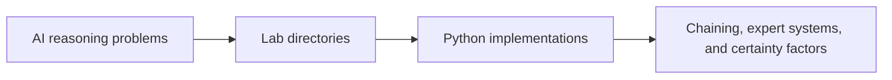

# CMPS 3560 – Artificial Intelligence

**California State University, Bakersfield**
**Instructor:** Professor

> [!TIP]
> The runnable examples are organized by lab directory; `lab_2` through `lab_5` and `lab_6` document the clearest inference-system progression from chaining to certainty factors.

## Course Overview

CMPS 3560 covered artificial intelligence concepts including search algorithms, knowledge representation, reasoning systems, and expert systems. Labs were completed in Python.

## Labs

| Lab | Topic |
|-----|-------|
| Lab 2 | Forward Chaining |
| Lab 3 | Backward Chaining |
| Lab 4 | Media Advisor (Expert System) |
| Lab 5 | Certainty Factors |
| Lab 6 | — |
| Lab 7 | — |
| Lab 8 | — |
| Lab 9 | — |
| Lab 10 | — |
| Lab 11 | — |
| Lab 12 | — |

## Skills Gained

- Knowledge representation and reasoning
- Forward and backward chaining inference engines
- Expert systems design
- Certainty factor calculations
- AI problem-solving techniques

## Languages Used

- Python

## Tech Stack

- **Tools:** Python 3, Linux (Odin server), Git
- **Concepts:** Artificial intelligence, expert systems, inference engines

## Coursework flow

